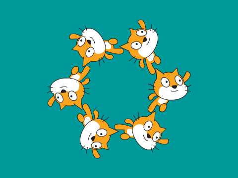

--- no-print ---

This is the **Scratch 2** version of the project. There is also a [Scratch 3 version of the project](https://projects.raspberrypi.org/cy-GB/projects/synchronised-swimming).

--- /no-print ---

## Cyflwyniad

Rwyt ti mynd i ddysgu sut i raglenni cyfres o symudiadau nofio cydamserol ar gyfer cath Scratch gan ddefnyddio dolennu a chreu cloniau. 

  <iframe allowtransparency="true" width="485" height="402" src="https://scratch.mit.edu/projects/embed/113149575/?autostart=false" frameborder="0"></iframe>
  

Fe alli di glicio ar y botwm coch i stopio'r gerddoriaeth!

--- collapse ---
---
title: Nodiadau i Wirfoddolwyr
---

## Adnoddau

Mae modd dod o hyd i gyfarwyddiadau'r prosiect yma [jumpto.cc/swim](http://jumpto.cc/swim). 

Ar gyfer y prosiect yma, dylid defnyddio Scratch 2.  Mae modd defnyddio Scratch 2 arlein yma [jumpto.cc/scratch-on](http://jumpto.cc/scratch-on) neu mae modd ei lawrlwytho yma [jumpto.cc/scratch-off](http://jumpto.cc/scratch-off) a'i ddefnyddio heb gysylltiad gwe.

Mae'r ddolen 'Adnoddau Prosiect' ar gyfer y prosiect yma yn cynnwys yr adnoddau canlynol:

## Adnoddau i Wirfoddolwyr

Mae modd gweld y prosiect wedi ei gwblhau yma <a href="http://scratch.mit.edu/projects/113149575/#editor">online</a>, neu mae modd ei lawrlwytho wrth glicio ar ddolen 'Adnoddau'r Prosiect' ar gyfer y prosiect yma, sydd yn cynnwys:

+ SynchronisedSwimming.sb2

## Adnoddau'r Prosiect

Ar gyfer y prosiect yma, dylid defnyddio Scratch 2.  Mae modd defnyddio Scratch 2 arlein yma [jumpto.cc/scratch-on](http://jumpto.cc/scratch-on) neu mae modd ei lawrlwytho yma [jumpto.cc/scratch-off](http://jumpto.cc/scratch-off) a'i ddefnyddio heb gysylltiad gwe.

## Nodau Dysgu
+ Ailadrodd (y bloc `ailadrodd`{:class="blockcontrol"}). 

Mae'r prosiect yma yn trin elfennau sydd yn rhan o'r adran ganlynol o [Faes Llafur Gwneud Digidol Raspberry Pi](http://rpf.io/curriculum):

+ [Defnyddio cystrawen iaith raglennu sylfaenol i greu rhaglenni syml](https://www.raspberrypi.org/curriculum/programming/creator)

## Heriau
+ "Codio trefn dy hunan" - Defnyddio bloc `ailadrodd`{:class="blockcontrol"} i raglenni trefn nofio penodol; 
+ "Newid y tîm" - Newid nifer y nofwyr yn y tîm trwy newid y nifer a safle o gloniau sydd yn cael eu creu.

--- /collapse ---
