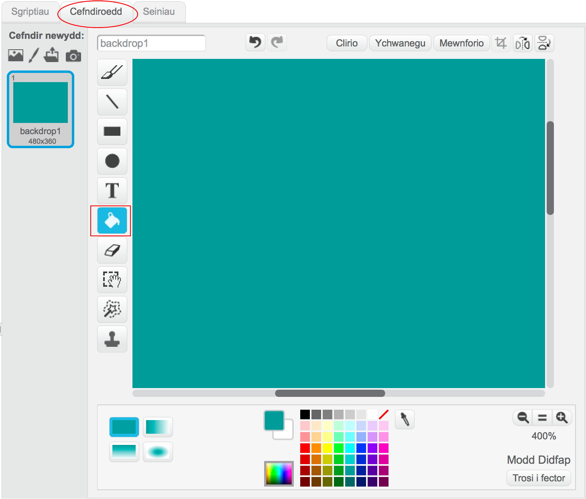
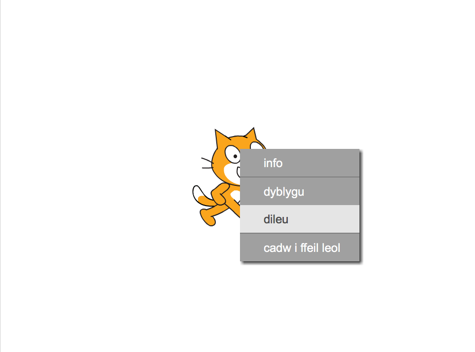
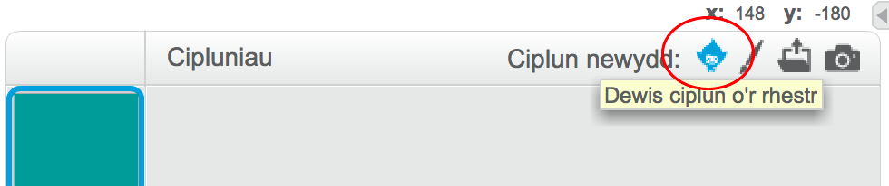
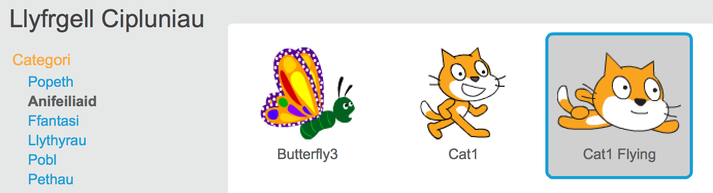
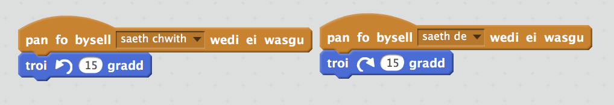
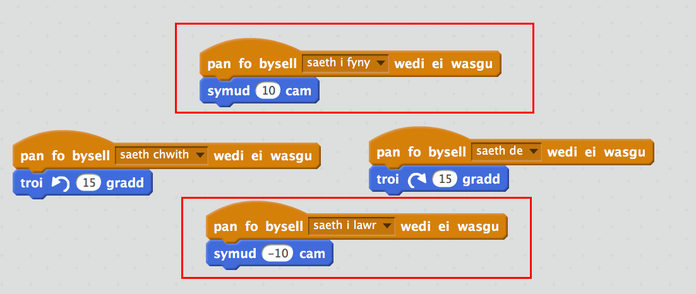

## Nofio i'r Chwith ac i'r Dde

I nofio yn gydamserol mae tîm o nofwyr yn perfformio cyfuniad o symudiadau yr un pryd i gerddoriaeth.

Fe wnawn ni ddechrau trwy gael un cath i nofio. 

+ Bydd angen creu prosiect Scratch newydd. Fe alli di ddod o hyd i'r golygydd Scratch arlein yma <a href="http://jumpto.cc/scratch-new" target="_blank">jumpto.cc/scratch-new</a>.

+ Yn gyntaf, fe wnawn ni droi y llwyfan yn las fel ei fod yn edrych fel pwll nofio.

	Clicia'r Llwyfan a gwasga'r tab 'Cefndiroedd'.
	
	Dewisa liw glas a chlicia'r teclyn 'Llenwi â lliw' cyn clicio'r cefndir.

	

+ Rwyt ti mynd i ddefnyddio ciplun cath gwahanol felly gwna clic-dde ar y gath i'w ddileu.

	

+ Nawr dewisa 'Dewis ciplun o'r rhestr'.

	

+ Dewisa 'Anifeiliaid' a 'Cat1 Flying' a chlicio 'Iawn'.

	

	Mae'r gath sydd yn hedfan yn edrych fel gallai fod yn nofio.
 
+ Nawr awn ni ati i wneud i'r gath nofio.

	Clicia ar giplun 'Cat1 flying' ac yna 'Sgriptiau' ac ychwanegu côd sydd yn gwneud i'r gath gylchdroi i'r chwith a dde pan wyt ti'n gwasgu'r saethau ar y bysellfwrdd. 
	
	
	
	
+ Profa dy gôd gan wasgu ar y saethau chwith a dde ar y bysellfwrdd.

	

+ Ac ychwanega symudiad ymlaen ac yn ôl:

	

+ Profa dy gôd gan nofio o gwmpas y llwyfan yn defnyddio'r saethau.
