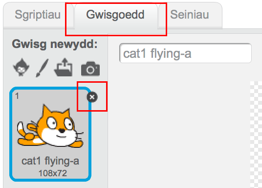
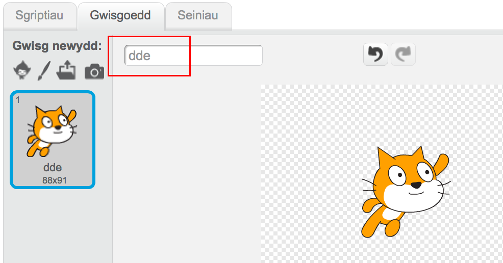
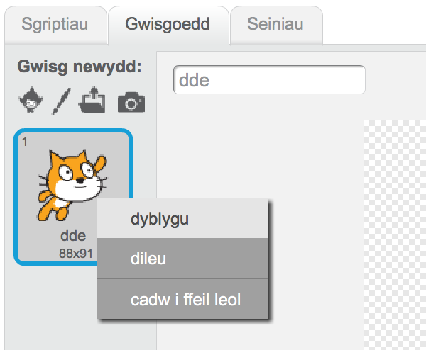
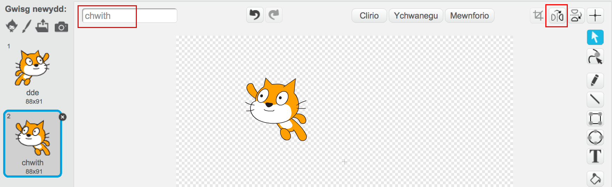
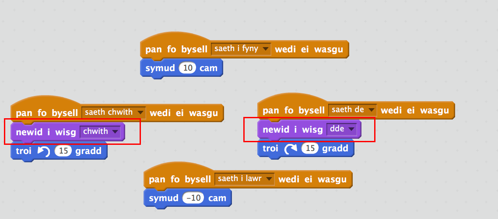

## Newid gwisg

Fe all hyn edrych yn well os yw ciplun y gath yn newid cyfeiriad pan mae'n troi i'r dde.

+ Clicia 'Gwisgoedd' a dileu gwisg 'cat1 flying-a'.

	 
	
+ Ail-enwa'r wisg sydd yn weddill yn 'dde'.

	

+ Gwna clic-dde ar y wisg a dewis dyblygu i greu copi.

	

+ Clicia 'Fflipio chwith-dde' i droi'r copi a'i alw yn 'chwith'.

	Fe ddylai dy wisg edrych fel hyn:

	

+ Clicia 'Sgriptiau' i fynd yn ôl i dy gôd ac ychwanegu blociau i neud y wisg pan mae'r cyfeiriad yn newid.

	

+ Profa dy gôd gan nofio o gwmpas y llwyfan yn defnyddio'r saethau.

	

