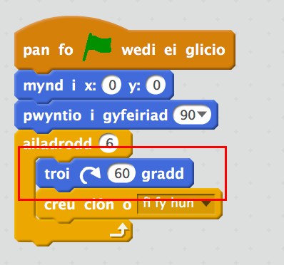

## Creu'r tîm

Mae tîm nofio cydamserol angen mwy nag un cath! Fe allwn ni ddefnyddio `creu clôn o`{:class="blockcontrol"} i greu copïau sydd yn ymddwyn yn yr un ffordd.

+ Yn gyntaf, fe wnawn ni ychwanegu côd i sicrhau fod y gath yn cychwyn yn yr un man bob tro mae'r faner werdd yn cael ei dewis.

	
	
+ Profa dy gôd trwy wasgu rhai saethau ar dy fysellfwrdd ac yna clicio'r faner werdd i fynd ôl i'r man cychwyn.

+ Nawr allwn ni ddefnyddio dolen `ailadrodd`{:class="blockcontrol"} i greu 6 clôn (copïau) o'r gath.

	Mae dolennau yn cael eu defnyddio i wneud yr un peth sawl gwaith. 
	
	

+ Dwyt ti ddim eisiau'r holl gathod yn yr un safle!

	Ychwanega gôd i droi 60 gradd cyn creu pob clôn.
	
	
	
+  Profa dy gôd gan ddefnyddio'r saethau. Fe ddylet allu creu patrymau nofio cydamserol anhygoel!

	
