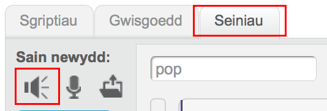
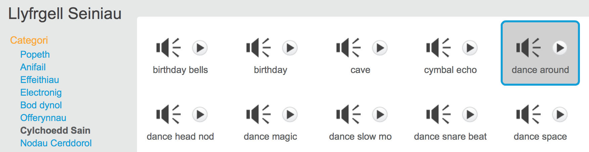
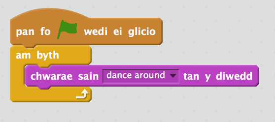

## Cerddoriaeth!

Mae nofio cydamserol angen cerddoriaeth felly awn ni ati i ychwanegu peth.

+ Clicia'r tab 'Seiniau' ac yna 'Dewis sain o'r rhestr'. 

	

+ Clicia 'Cylchoedd Sain' a dewis cerddoriaeth a gwasgu 'Iawn'.		

	

+ Nawr cer yn ôl i 'Sgriptiau' ac ychwanegu blociau i chwarae dy gerddoriaeth:

	
	
	Mae gosod `chwarae sain`{:class="blocksound"} o fewn dolen `am byth`{:class="blockcontrol"} yn golygu bydd y gerddoriaeth yn cadw ailadrodd.

+ Profa dy brosiect. 

	Fe alli di glicio ar y botwm coch i stopio'r gerddoriaeth!

