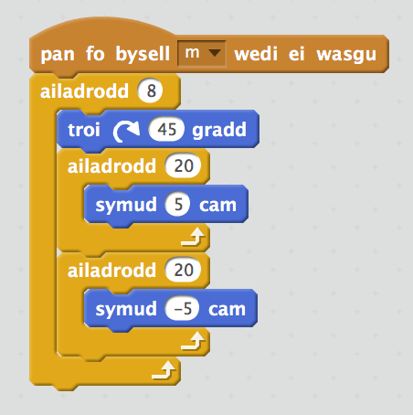

--- challenge ---
## Her: Codio dy drefn dy hunan 

Wyt ti'n gallu ysgrifennu trefn nofio cydamserol dy hunan i gael ei berfformio pan wyt ti'n gwasgu'r bylchwr neu allwedd arall?

Ceisia greu tren yn defnyddio'r saethau gyntaf. 

Defnyddia dolennu `ailadrodd`{:class="blockcontrol"} i berfformio'r un symudiadau sawl gwaith.

Dyma enghraifft:

--- /challenge ---
