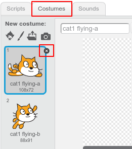
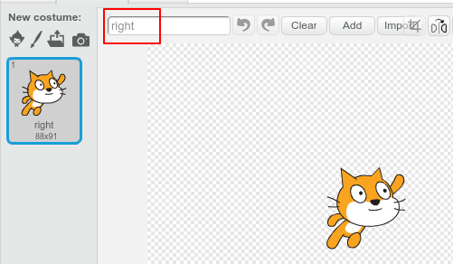
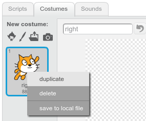
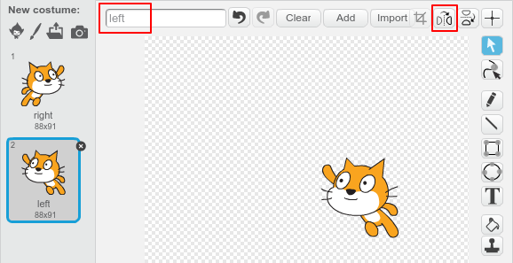

## Changing costume

Hmm, this would look better if the cat sprite changed direction when it turns left. 

--- task ---

Click on 'Costumes' and delete the 'cat1 flying-a' costume.

 

--- /task ---

--- task ---

Rename the remaining costume from 'cat1 flying-b' to 'right'. 



--- /task ---

--- task ---

Right-click on the costume and choose duplicate to create a copy. 



--- /task ---

--- task ---

Click 'Flip left-right' to reverse the copy and then name it 'left'. 

Your costumes should look like this:



--- /task ---

--- task ---

Click 'Scripts' to return to your code and add blocks to change the costume when the direction is changed. 


```blocks
when [left arrow v] key pressed
+switch costume to [left v]
turn ccw (15) degrees

when [right arrow v] key pressed
+switch costume to [right v]
turn cw (15) degrees
```
--- /task ---

--- task ---

Test your code by swimming around the stage using the arrow keys. 


--- /task ---
