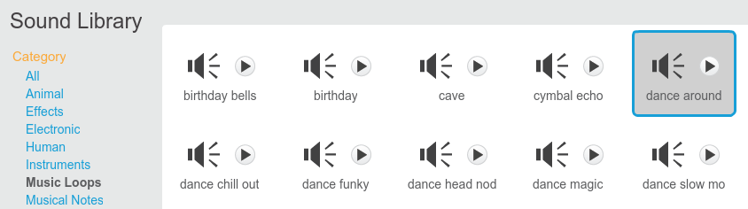

## Music!

A synchronised swimming routine needs music. (But, if you can't play sound then you can skip this step.)

--- task ---

Choose a sound from the `Music Loops` category and add it to your sprite.

[[[generic-scratch-sound-from-library]]]



--- /task ---

--- task ---

Now go back to 'Scripts' and add the blocks to play your music: 


```blocks
when green flag clicked
forever
play sound [dance around v] until done
end
```
	
Putting the `play sound`{:class="blocksound"} inside a `forever`{:class="blockcontrol"} loop means the music will keep repeating. 

--- /task ---

--- task ---

Test your project. 

You can click on the red stop button to stop the music playing!

--- /task ---

